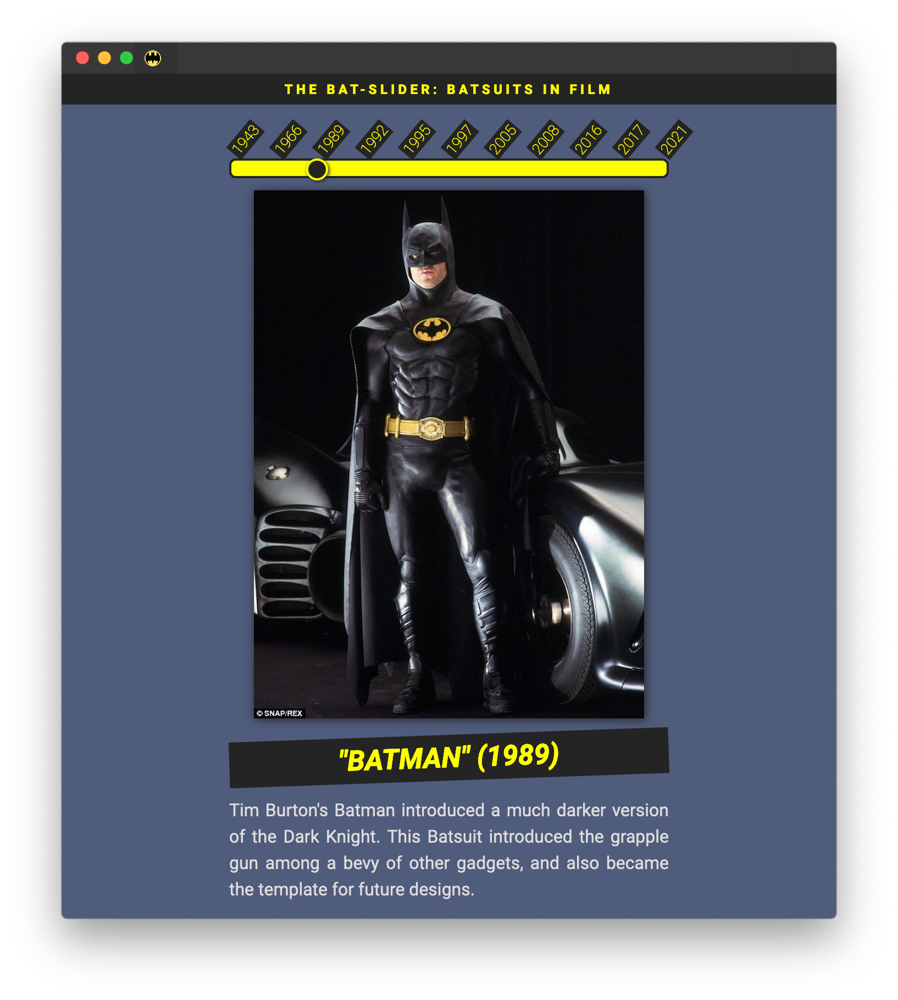

<h1>

</h1>

<div align="center">
  
  
  
  
</div>

<div align="center">
  <strong>A Bat-Suit React SPA</strong>
</div>

<p align="center">
  <sub>Built with ❤︎ by
  <a href="https://timmybytes.com">Timothy Merritt</a>
</div>

# The Bat-Slider



This is a React SPA to display information on the various Bat-Suits seen in film over the years. When you need fast information on Bat-Suits, you need the Bat-Slider.

The goal of the project was to get more practice using state in React, JSON objects, CSS Flexbox, npm, and GitHub deployment, while having a little fun with my love for superheroes.

[Demo](https://timmybytes.github.io/react-bat-slider-app/)

## Usage

The Bat-Slider is bootstrapped from [`create-react-app`](https://create-react-app.dev/) with some modified scripts.

### Getting Started

Fork and/or clone the repo locally.

```sh
git clone https://github.com/timmybytes/bat-slider.git
```

Install dependencies.

```sh
cd bat-slider/
npm install
```

### Development

Start a local server for see changes live.

```sh
npm start
```

#### SCSS

The Bat-Slider uses [SCSS](https://sass-lang.com) for styling, which needs to be compiled to CSS before it can be valid in a browser.

```sh
# Compile SCSS to CSS -- default is compressed CSS output
npm run scss
# Compile live on each change
npm run scss:watch
```

#### Accessibility Tests

The Bat-Slider uses a [Lighthouse](https://developers.google.com/web/tools/lighthouse/) script to check for accessibility and performance issues.

**Note**: Before running Lighthouse, make sure a local server is running with `npm start`.

```sh
# Run a Lighthouse test. By default, the test results will
# output in HTML format to /tests/lighthouse/lighthouse-test.html
# and displays the test results in your browser
npm run a11y
```

### Build & Deploy

The Bat-Slider uses the [`gh-pages`](https://www.npmjs.com/package/gh-pages) package for easy deployment.

```sh
# Compiles SCSS into CSS, builds assets for deployment
npm run predeploy
# Builds and deploys to a `deploy` branch by default
# Add your preferred homepage for deployment in package.json
npm run deploy
```

## License

Bat-Slider is available under an [MIT license](./LICENSE.md).

## Contributing

Feel free to submit a Pull Request or open an issue for a feature request.
